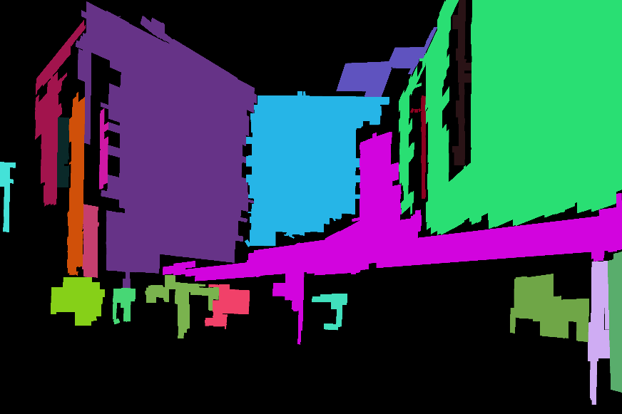
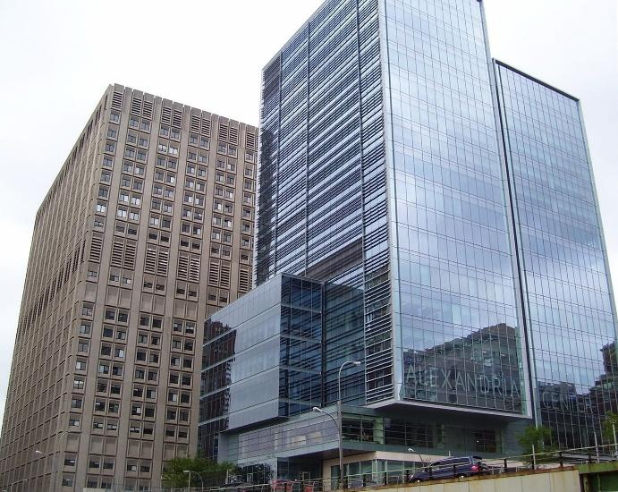
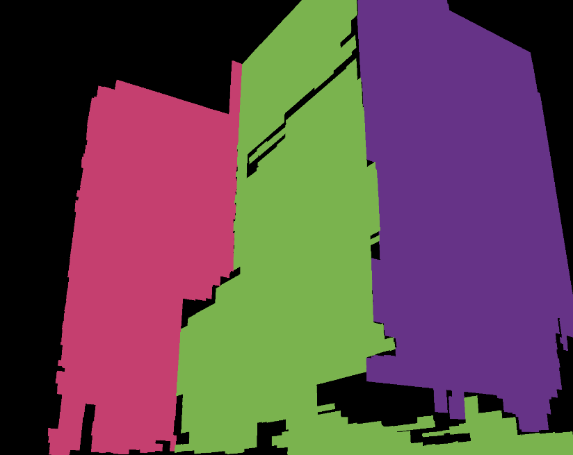
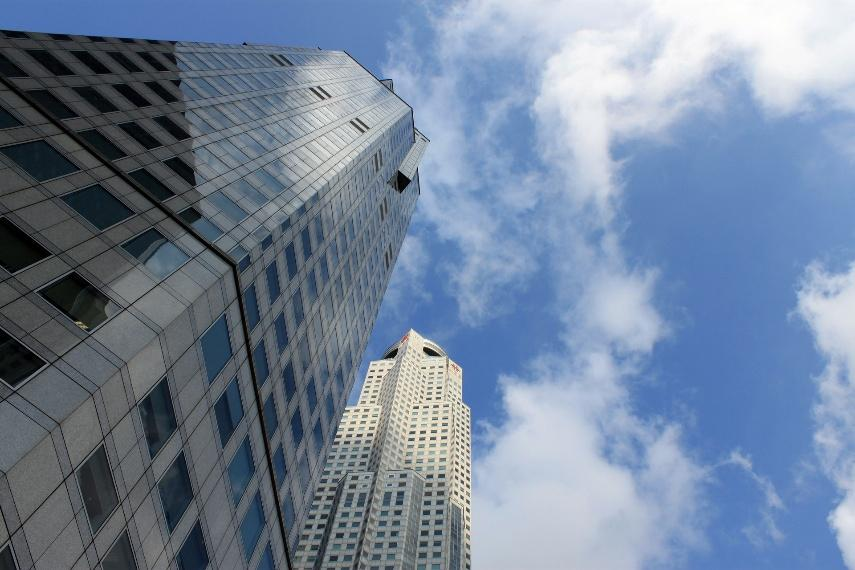
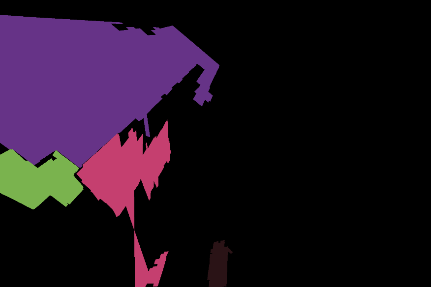

# PlaneDetection

PlaneDetection - C++ проект для обнаружения плоскостей на изображениях городской среды без использования нейросетевых моделей. Приложение строит изображение того же размера, что и входной кадр, где цвет каждого пикселя показывает принадлежность к найденной плоскости.

## Возможности

- построение цветовой разметки плоскостей для входного изображения;
- сохранение результата в виде PNG-файла, где каждая найденная плоскость отмечена отдельным цветом;
- возможность получить результат с автоматической оценкой фокусного расстояния или с вручную заданными параметрами камеры;
- сохранение промежуточных изображений для визуальной проверки этапов обработки;
- формирование JSON-отчета при сравнении результата с ручной разметкой.

## Примеры работы

Ниже показаны примеры из директории `examples/`. В каждой паре слева приведено входное изображение, справа - результат работы `plane_detector`.

### Пример 1

| Входное изображение | Результат |
| --- | --- |
|  |  |

### Пример 2

| Входное изображение | Результат |
| --- | --- |
|  |  |

### Пример 3

| Входное изображение | Результат |
| --- | --- |
|  |  |

## Ограничения модели

Алгоритм рассчитан на изображения, где хорошо выражены прямые линии и достаточно много пересекающихся отрезков. Для упрощения задачи используются следующие предположения:

- главная точка изображения известна или принимается равной центру изображения;
- пиксели изображения квадратные;
- пересекающиеся линии на изображении считаются перпендикулярными в пространстве.

Лучшие результаты обычно получаются на крупных плоскостях фасадов, стен, крыш и других городских объектов. Небольшие плоскости или области с малым количеством линий могут теряться.

## Структура проекта

```text
.
├── plane_detector.cpp                         # CLI для обнаружения плоскостей
├── compare_planes.cpp                         # CLI для сравнения предсказания с ground truth
├── include/
│   ├── focal_length_estimation/               # оценка фокусного расстояния
│   ├── plane_detection_utils/                 # общие структуры и утилиты
│   ├── plane_orientation_detection/           # поиск ориентаций плоскостей
│   ├── plane_labeling/                        # построение областей плоскостей
│   ├── plane_post_processing/                 # постобработка масок
│   └── result_evaluation/                     # оценка качества
├── thirdparty/JLinkage/                       # реализация J-Linkage для точек схода
├── images/                                    # тестовые изображения
├── ground_truth/                              # ручная разметка тестовых изображений
├── examples/                                  # примеры входных изображений и результатов
├── scripts/                                   # скрипты пакетного запуска
├── CMakeLists.txt
├── CMakePresets.json
└── vcpkg.json
```

## Предварительные требования

- C++ компилятор с поддержкой стандарта C++20;
- CMake 3.21 или новее;
- vcpkg с поддержкой manifest mode;
- OpenCV 4.10.0 или новее;
- nlohmann-json;
- Git.

Зависимости OpenCV и nlohmann-json описаны в `vcpkg.json` и устанавливаются через vcpkg.

## Установка и сборка

Склонируйте репозиторий:

```bash
git clone https://github.com/m1n1tea/PlaneDetection
cd PlaneDetection
```

Убедитесь, что переменная `VCPKG_ROOT` указывает на установленный vcpkg:

```bash
export VCPKG_ROOT=/path/to/vcpkg
```

Установите зависимости:

```bash
vcpkg install
```

Сборка на Linux:

```bash
cmake --preset linux_release
cmake --build --preset linux_release
```

Сборка на Windows:

```powershell
cmake --preset windows_release
cmake --build --preset windows_release
```

После сборки исполняемые файлы находятся в директории сборки. Для установки в отдельную директорию используйте:

```bash
cmake --install build --prefix ./install
```

При установке копируются консольные приложения, тестовые изображения, разметка и демонстрационные скрипты.

## Использование

В проекте есть два консольных приложения:

- `plane_detector` - обнаруживает плоскости на изображении;
- `compare_planes` - сравнивает предсказанную разметку с ручной разметкой.

### Обнаружение плоскостей

Базовый запуск:

```bash
./build/plane_detector images/sample_image.jpg .
```

Результат будет сохранен в текущую директорию:

```text
sample_image_result.png
```

Каждая найденная плоскость будет закрашена отдельным цветом. Черный цвет означает фон или область, которая не была отнесена к плоскости.

Запуск с ручным фокусным расстоянием:

```bash
./build/plane_detector -f=1600 images/sample_image.jpg .
```

Запуск с конфигурационным файлом:

```bash
mkdir -p output
./build/plane_detector -c=config.json images/sample_image.jpg output
```

Генерация стандартного конфига:

```bash
./build/plane_detector -g
```

Или в конкретный путь:

```bash
./build/plane_detector -g=config/default_config.json
```

### Конфигурация

Стандартный конфиг содержит основные параметры алгоритма:

```json
{
  "save_intermediate_steps": false,
  "verbose": true,
  "focal_length": 0,
  "principal_point_in_the_middle": true,
  "principal_point": [0, 0],
  "focal_length_estimation": {
    "adjacency_relative_length_threshold": 0.02,
    "adjacency_angle_threshold": 0.17453292519943295,
    "vanishing_point_relative_threshold": 0.1,
    "vanishing_point_absolute_threshold": 10
  },
  "plane_orientation_detection": {
    "adjacency_relative_length_threshold": 0.25,
    "adjacency_angle_threshold": 0.17453292519943295,
    "ransac_threshold": 0.01,
    "ransac_tries": 1000,
    "plane_relative_threshold": 0.1,
    "plane_absolute_threshold": 10
  },
  "plane_labeling": {
    "adjacency_relative_length_threshold": 1,
    "adjacency_angle_threshold": 0.17453292519943295
  },
  "plane_post_processing": {
    "noise_relative_part": 0.15,
    "gaps_relative_part": 0.05
  }
}
```

Ключевые параметры:

- `focal_length` - фокусное расстояние. Если значение меньше или равно `0`, оно оценивается автоматически;
- `principal_point_in_the_middle` - использовать центр изображения как главную точку;
- `principal_point` - главная точка изображения, если `principal_point_in_the_middle` равно `false`;
- `save_intermediate_steps` - сохранять промежуточные визуализации;
- `verbose` - печатать подробную информацию о ходе работы;
- параметры с `angle` задаются в радианах.

Если включить `save_intermediate_steps`, дополнительно сохраняются:

```text
<image>_detected_lines.png
<image>_detected_labeled_lines.png
<image>_detected_labeled_pixels.png
<image>_detected_labeled_pixels_processed.png
<image>_detected_vanishing_points.png
```

Файл с точками схода сохраняется только при автоматической оценке фокусного расстояния.

### Сравнение с ручной разметкой

```bash
./build/compare_planes sample_image_result.png ground_truth/sample_image_ground_truth.png
```

Приложение выводит JSON-отчет:

```json
{
  "correct_predicted_pixels": 2452982,
  "f1_plane_separation": 0.8060789246769089,
  "ground_truth_labels": [
    {
      "corresponding_predicted_plane_color": "#663387",
      "intersection_over_union": 0.7116972772859342,
      "plane_color": "#ff1c2e"
    }
  ],
  "incorrect_predicted_pixels": 1180244
}
```

Основная метрика - `f1_plane_separation`. Она оценивает, насколько хорошо алгоритм разделяет пиксели по соответствующим плоскостям.

### Пакетная обработка тестовых изображений

После установки проекта доступны демонстрационные скрипты. Они обрабатывают 10 тестовых изображений, сохраняют предсказания в `generated_images/`, отчеты в `generated_reports/` и печатают значения `f1_plane_separation`.

Автоматический режим:

```bash
./install/demo_scripts/generate_predictions_and_output.sh
```

Режим с заранее заданными фокусными расстояниями:

```bash
./install/demo_scripts/generate_predictions_and_output_with_focal_length.sh
```

На Windows используются аналогичные PowerShell-скрипты:

```powershell
.\install\demo_scripts\generate_predictions_and_output.ps1
.\install\demo_scripts\generate_predictions_and_output_with_focal_length.ps1
```

## Краткое описание алгоритма

1. На изображении находятся линейные сегменты.
2. При необходимости фокусное расстояние оценивается автоматически:
   - строятся гипотезы точек схода;
   - отрезки кластеризуются по точкам схода с использованием J-Linkage;
   - определяются пары перпендикулярных точек схода;
   - по ним вычисляется фокусное расстояние.
3. Для множества пересекающихся отрезков ищутся ориентации плоскостей с помощью RANSAC.
4. Пары отрезков преобразуются в прямоугольные области, спроецированные на соответствующую плоскость.
5. Конфликтующие области разных плоскостей фильтруются.
6. Маски постобрабатываются: удаляются шумовые компоненты и заполняются небольшие разрывы.
7. Итоговые компоненты связности получают разные цвета и сохраняются как результат.

## Использованные источники

- Aamer Zaheer, Maheen Rashid, Muhammad Ahmed Riaz, Sohaib Khan. *Single-View Reconstruction using orthogonal line-pairs*, 2018.
- Rafael Grompone von Gioi, Jeremie Jakubowicz, Jean-Michel Morel, Gregory Randall. *LSD: a Line Segment Detector*, 2012.
- Toldo R., Fusiello A. *Robust Multiple Structures Estimation with J-Linkage*, ECCV 2008.
- Tardif J.-P. *Non-iterative Approach for Fast and Accurate Vanishing Point Detection*, ICCV 2009.
- HarborC/JLinkage: <https://github.com/HarborC/JLinkage>
